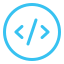

<!-- PROJECT LOGO -->
<br />
<p align="center">
  <a href="https://github.com/lucky-lore/main-portfolio">
    
  </a>

  <h1 align="center">Personal Portfolio</h1>

  <p align="center">
     Loretta Krasteva's personal portfolio. Built with React, Redux Toolkit, React Router and SASS (Still in development)
    <br />
    <a href="https://github.com/lucky-lore/main-portfolio#readme"><strong>Explore the docs »</strong></a>
    <br />
    <br />
    <a href="https://loretta-arineva.dev/">View Live</a>
    ·
    <a href="https://github.com/lucky-lore/main-portfolio/issues">Report Bug</a>
    ·
    <a href="https://github.com/lucky-lore/main-portfolio/issues">Request Feature</a>
  </p>
</p>

<a href="https://github.com/lucky-lore" target="_blank">

</a>
<a href="https://linkedin.com/in/loretta-krasteva" target="_blank">

</a>  
  

<!-- TABLE OF CONTENTS -->
<details open="open">
  <summary>Table of Contents</summary>
  <ol>
    <li>
      <a href="#about-the-project">About The Project</a>
      <ul>
        <li><a href="#built-with">Built With</a></li>
      </ul>
    </li>
    <li>
      <a href="#getting-started">Getting Started</a>
      <ul>
        <li><a href="#installation-and-setup">Installation and Setup</a></li>
        <li><a href="#getting-started-with-create-react-app">Getting Started With Create React App</a></li>
        <li><a href="#prerequisites">Prerequisites</a></li>
      </ul>
    </li>
    <li>
      <a href="#project-status">Project Status</a>
      <ul>
        <li><a href="#current">Current</a></li>
        <li><a href="#next-steps">Next Steps</a></li>
      </ul>
    </li>
    <li>
      <a href="#project-screenshots">Project Screenshots</a>
      <ul>
        <li><a href="#preview">Preview</a></li>
      </ul>
    </li>
    <li>
      <a href="#reflection">Reflection</a>
      <ul>
        <li><a href="#goals">Goals</a></li>
      </ul>
    </li>
    <li><a href="#support-me">Support Me</a></li>
    <li><a href="#usage">Usage</a></li>
    <li><a href="#roadmap">Roadmap</a></li>
    <li><a href="#contributing">Contributing</a></li>
    <li><a href="#license">License</a></li>
    <li><a href="#contact">Contact</a></li>
    <li><a href="#acknowledgements">Acknowledgements</a></li>
  </ol>
</details>


<!-- ABOUT THE PROJECT -->
## About The Project

**Note**: Project is still in development!

### Built With

This section lists any major frameworks and methodologies that I used to build my project.

* [React](https://reactjs.org/)
* [Redux Toolkit](https://redux-toolkit.js.org/)
* [React Router](https://reactrouter.com/)
* [SASS](https://sass-lang.com/)
* Flexbox
* Mobile-first 
* Semantic HTML5 markup


<!-- GETTING STARTED -->
## Getting Started

### Installation and Setup

Clone down this repository. You will need `node` and `npm` installed globally on your machine.  

Installation:

`npm install`  

To Start Server:

`npm start`  

To Visit App:

`localhost:3000`  


### Getting Started with Create React App

This project was bootstrapped with [Create React App](https://github.com/facebook/create-react-app).

#### `npm run build`

Builds the app for production to the `build` folder.\
It correctly bundles React in production mode and optimizes the build for the best performance.

The build is minified and the filenames include the hashes.\
Your app is ready to be deployed!

See the section about [deployment](https://facebook.github.io/create-react-app/docs/deployment) for more information.


### Prerequisites

<!-- This is an example of how to list things you need to use the software and how to install them.
* npm
  ```sh
  npm install npm@latest -g
  ``` -->


## Project Status

### Current
Adding animations

### Next steps:
- [x] ~~Adding a contact form.~~
- [x] ~~Adding About me content.~~
- [x] ~~Adding a progress bar functionality.~~
- [ ] Adding entrance and exit component animations.
- [ ] Adding item entrance animations.
- [ ] Adding another theme color to the entire website.
- [ ] Improving on-site and technical SEO.
  - [x] ~~Adding lazy loading.~~
  - [x] ~~Improving GT Metrix stats.~~
  - [x] ~~Configuring metas for social meadia.~~
- [ ] Implementing a better git flow method for updating content and developing a game.
- [ ] Adding an arcade game.
- [ ] Refactoring code.


## Project Screenshots

### Preview:   

N/A - Coming soon

See live: [Portfolio](https://loretta-krasteva.com/)

Project Link: [https://github.com/sudo-ditto/main-portfolio](https://github.com/sudo-ditto/main-portfolio)


## Reflection

  <!-- - This is a side project to test out my skills.
  - P.S I love building this!
  - Initially I was planning on building this with Context API, however after a while it became so cumbersome that I ended up with some spaghetti code and decided to hard reset to my previous commit. The reason I decided to go with Context API is because I thought Redux would be an overkill for this small app and it gets quite repetitive with creating constants, acitions, reducers, combining reducers etc. Fortunately, I found out about an amazing third-party app, built by the Redux team, called Redux Toolkit which is in my opinion very elegant and helps you write very clean code. In just 20 minutes I got the hang of it and I feel like I just won the lottery today. I love it!
  - P.S by hour 8 I was wondering why my custom component is not rendering and after careful debugging, I saw I wasn't returning it from my map function... this is when I knew I needed a break  -->

### Goals:  

I have spent a total of 35 hours building this project.


## Support me

[](https://www.buymeacoffee.com/gbraad)

[](https://paypal.me/LoretaKrasteva?locale.x=en_GB)


<!-- USAGE EXAMPLES -->
## Usage

Loretta Krasteva: Front-End Web Developer

_For more examples, please refer to the [Documentation](https://github.com/sudo-ditto/planets-fact)_


<!-- ROADMAP -->
## Roadmap

See the [open issues](https://github.com/sudo-ditto/main-portfolio/issues) for a list of proposed features (and known issues).


<!-- CONTRIBUTING -->
## Contributing

Contributions are what make the open source community such an amazing place to be learn, inspire, and create. Any contributions you make are **greatly appreciated**.

1. Fork the Project
2. Create your Feature Branch (`git checkout -b feature/AmazingFeature`)
3. Commit your Changes (`git commit -m 'Add some AmazingFeature'`)
4. Push to the Branch (`git push origin feature/AmazingFeature`)
5. Open a Pull Request

<!-- LICENSE -->
## License

Distributed under the MIT License. See `LICENSE` for more information.

<!-- CONTACT -->
## Contact

### Author
> Loretta Krasteva

<a href="https://github.com/lucky-lore" target="_blank">

</a>
<a href="https://linkedin.com/in/loretta-krasteva" target="_blank">

</a>  
  

<!-- ACKNOWLEDGEMENTS -->
## Acknowledgements
* [Stack Overflow](https://stackoverflow.com/)
